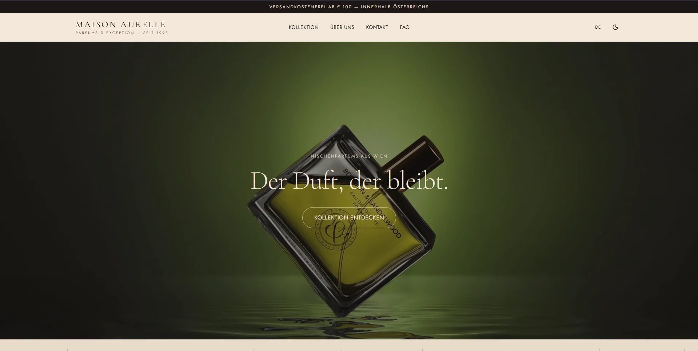
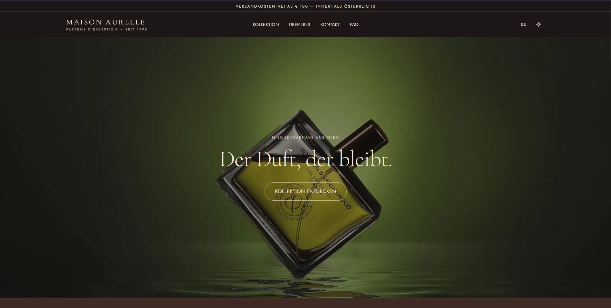
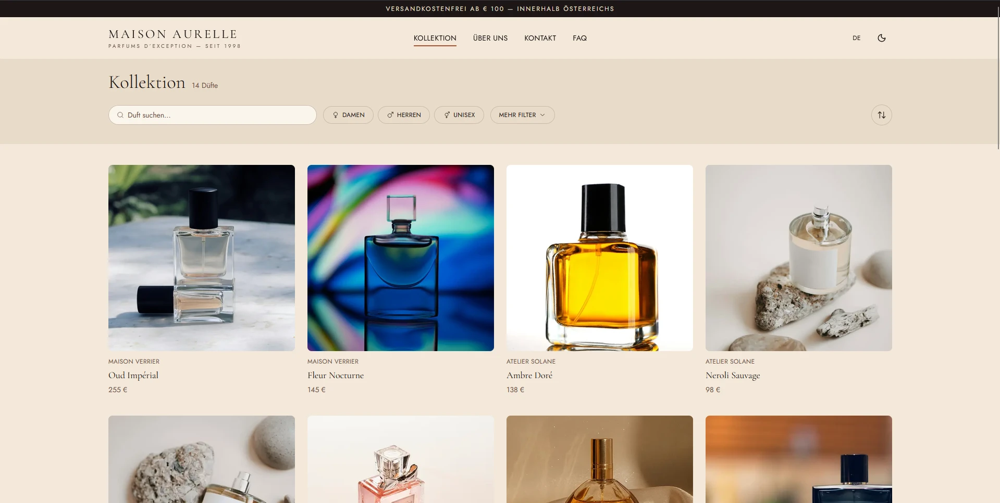
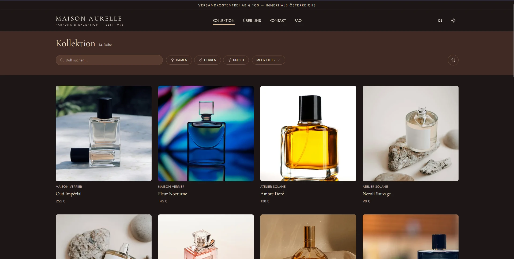

*[This page in English](README.md)*

# Maison Aurelle — Nischenparfümerie (Konzept)

Ein fiktives E-Commerce-Konzept für eine Nischenparfümerie, umgesetzt als vollständig responsive Next.js-Frontend. Ziel war es, ein modernes, editoriales Shop-Erlebnis von Anfang bis Ende umzusetzen — kein Template, sondern ein echter Produktkatalog mit Filterung, Produktseiten und vollständig zweisprachiger Oberfläche.

**Live-Demo:** https://nextjs-perfume-shop-concept.vercel.app

> Dies ist ein Konzept-/Portfolio-Projekt. "Maison Aurelle" ist eine fiktive Marke, hinter Warenkorb und Checkout steckt kein echtes Bestellsystem.

## Screenshots

| Startseite (Light) | Startseite (Dark) |
|---|---|
|  |  |

| Kollektion (Light) | Kollektion (Dark) |
|---|---|
|  |  |

## Funktionen

- Vollständig responsives Layout (Mobile, Tablet, Desktop)
- Light- und Dark-Theme, bleibt über Besuche hinweg gespeichert
- Deutsche/englische Oberfläche via `next-intl`, mit lokalisierten Routen (`/de`, `/en`)
- Kollektionsseite mit Suche, Kategorie-, Marken-, Noten-, Konzentrations- und Preisfilter sowie Sortierung
- Produktdetailseiten mit Notenpyramide, Größenauswahl und ähnlichen Produkten
- Barrierefreie Formulare (Kontaktformular mit sauberen Fehlerzuständen und `aria-live`-Feedback)
- SEO-Grundlagen: Metadaten, Open-Graph-Tags, Sitemap

## Tech-Stack

- [Next.js](https://nextjs.org/) (App Router)
- React 19 + TypeScript
- Tailwind CSS v4
- [next-intl](https://next-intl.dev/) für Internationalisierung
- [next-themes](https://github.com/pacocoursey/next-themes) für den Theme-Wechsel
- Zod für Formularvalidierung
- Deployed auf [Vercel](https://vercel.com/)

## Erste Schritte

```bash
npm install
npm run dev
```

Danach [http://localhost:3000](http://localhost:3000) öffnen.

## Status

Das Frontend ist fertig und deployed. Ein echtes Backend (Bestellung, Zahlung, Lagerbestand) war für diese Phase bewusst nicht Teil des Scopes.
