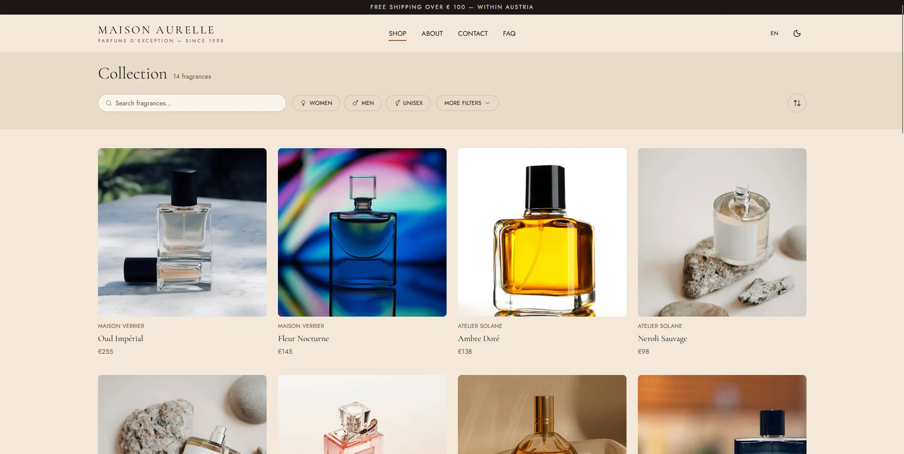
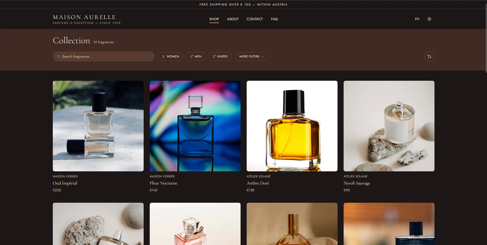

*[Diese Seite auf Deutsch](README.de.md)*

# Maison Aurelle — Niche Perfume Shop (Concept)

A fictional e-commerce concept for a niche fragrance boutique, built as a fully responsive Next.js frontend. The goal was to design and implement a modern, editorial-style shop experience end to end — not just a template, but a real product catalog with filtering, product pages, and a full bilingual UI.

**Live demo:** https://nextjs-perfume-shop-concept.vercel.app

> This is a concept/portfolio project. "Maison Aurelle" is a fictional brand, and there is no real ordering system behind the cart or checkout flow.

## Screenshots

| Home (Light) | Home (Dark) |
|---|---|
|  |  |

| Collection (Light) | Collection (Dark) |
|---|---|
|  |  |

## Features

- Fully responsive layout (mobile, tablet, desktop)
- Light and dark theme, persisted across visits
- German/English UI via `next-intl`, with localized routes (`/de`, `/en`)
- Collection page with search, category, brand, note, concentration, and price filtering, plus sorting
- Product detail pages with notes breakdown, size selection, and related products
- Accessible form handling (contact form with proper error states and `aria-live` feedback)
- SEO basics: metadata, Open Graph tags, sitemap

## Tech Stack

- [Next.js](https://nextjs.org/) (App Router)
- React 19 + TypeScript
- Tailwind CSS v4
- [next-intl](https://next-intl.dev/) for internationalization
- [next-themes](https://github.com/pacocoursey/next-themes) for theme switching
- Zod for form validation
- Deployed on [Vercel](https://vercel.com/)

## Getting Started

```bash
npm install
npm run dev
```

Then open [http://localhost:3000](http://localhost:3000).

## Status

Frontend is complete and deployed. A real backend (ordering, payments, inventory) was intentionally out of scope for this phase.
